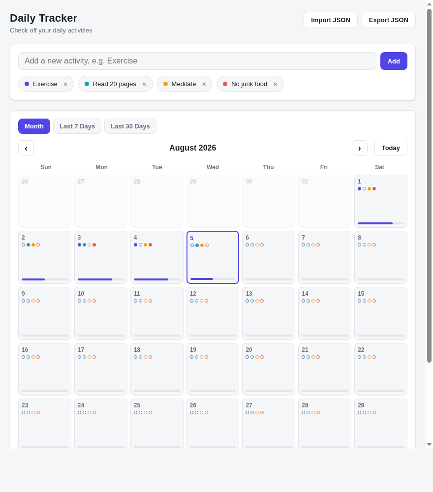
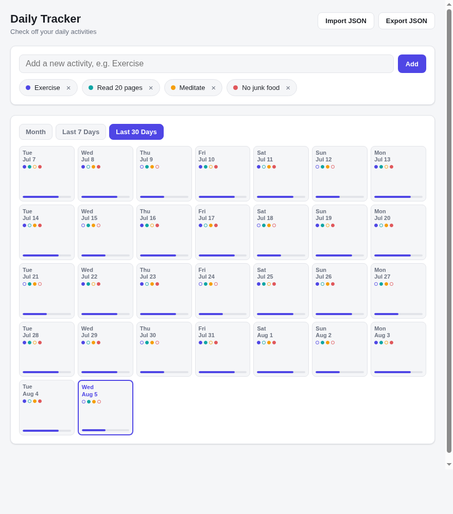
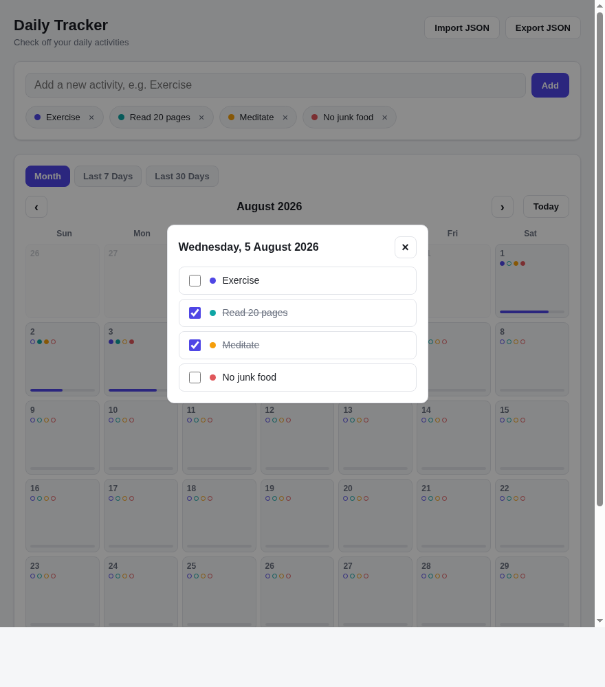

# Daily Tracker

A small, dependency-free habit tracker. Define the activities you want to do
every day, then check them off on a calendar. All data stays in your
browser's `localStorage` — nothing is sent anywhere — and you can export or
import your history as a JSON file whenever you like.

## Features

- **Recurring activities** — add activities once (e.g. "Exercise", "Read
  20 pages"); they apply to every day going forward.
- **Three calendar views** — Month, Last 7 Days, and Last 30 Days, so you
  can check a specific date or scan a recent streak at a glance.
- **Per-day checklist** — click any day to open a checklist and tick off
  what you finished. Each day cell shows a dot per activity and a progress
  bar for a quick read of how the day went.
- **Local persistence** — your data is saved automatically to the browser's
  `localStorage`; closing the tab doesn't lose anything.
- **Export / Import JSON** — download your full activity list and history
  as a `.json` file (for backup or moving to another browser), and load it
  back in later.

## Running it

No build step, no dependencies. Just serve the folder and open it:

```bash
python3 -m http.server 8000
```

Then visit `http://localhost:8000` in your browser. Opening `index.html`
directly (`file://`) also works in most browsers.

## Usage

1. Add your activities in the box at the top (e.g. "Exercise", "Meditate").
2. Click any day in the calendar to open its checklist and tick off what
   you completed.
3. Switch between **Month**, **Last 7 Days**, and **Last 30 Days** to
   review recent progress.
4. Use **Export JSON** to save a backup file, and **Import JSON** to
   restore it (this replaces your current activities and history).

## Screenshots

**Month view** — each day shows a dot per activity and a completion bar.



**Last 30 Days** — a rolling view of recent days, useful for spotting streaks.



**Day checklist** — click a day to check off what you finished.



## Data & privacy

All data lives only in your browser's `localStorage` for this page's
origin — it is never transmitted anywhere. Clearing your browser's site
data will erase it, so use **Export JSON** periodically if you want a
backup.
